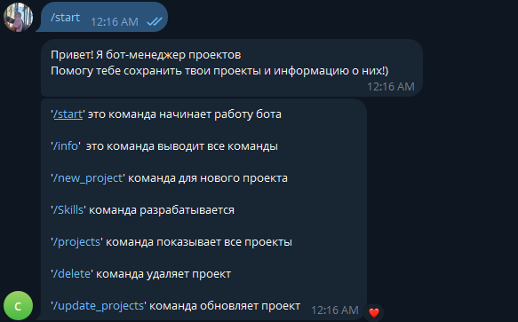
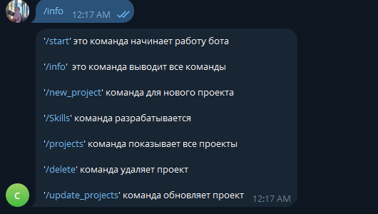
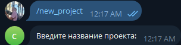
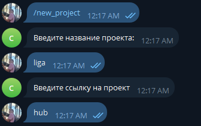
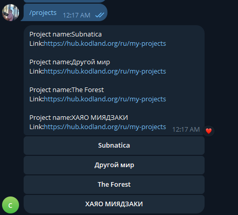
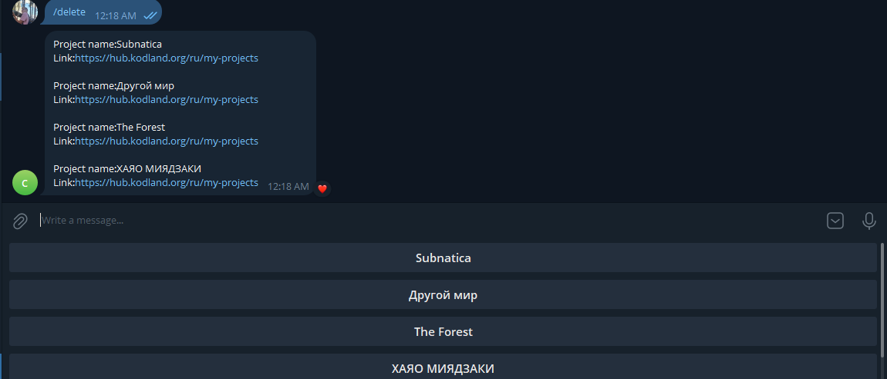
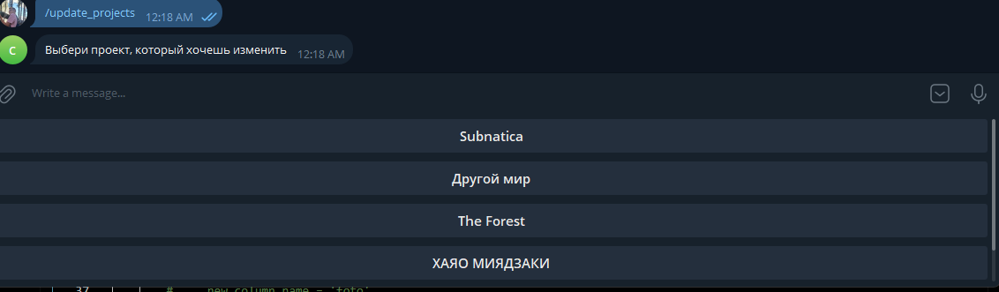
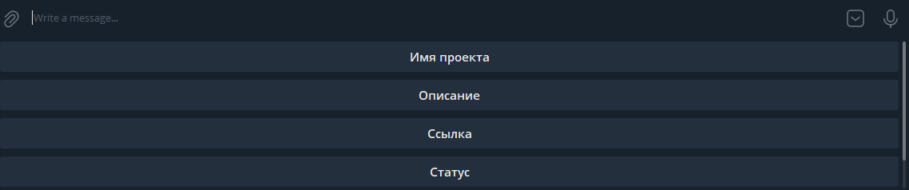

# Bot potfolio
Это бот портфолио которые хранит ваши или другого человека проекты и скилы
# Bot comamnts
'start' это команда начинает работу бота

'info'  это команда выводит все команды 

'new_project' команда для нового проекта

'skills' команда разрабатывается

'projects' команда показывает все проекты

'delete' команда удаляет проект

'update_projects' команда обновляет проект

